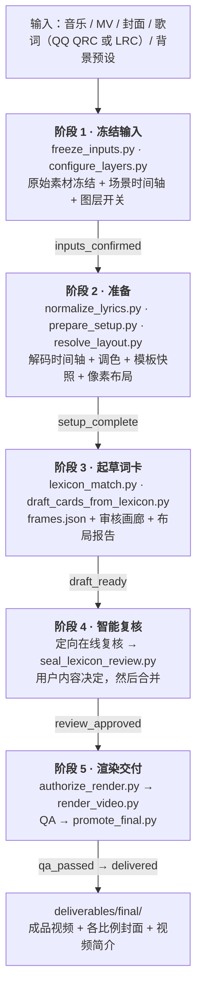
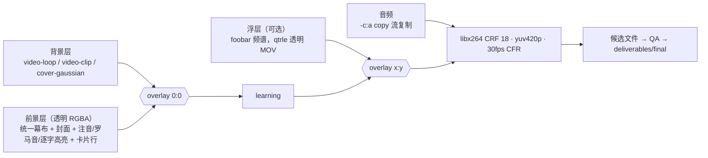
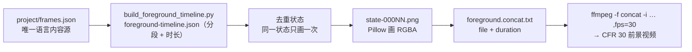
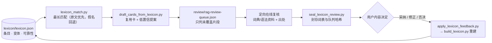
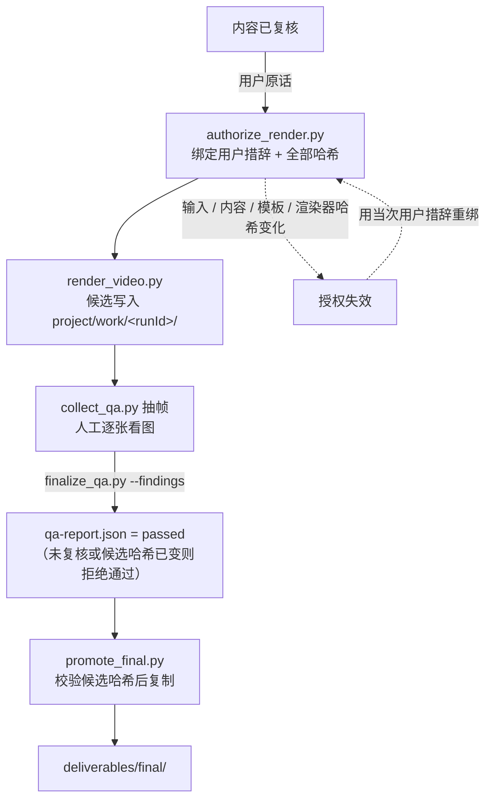

# Music JLPT — 日语歌曲学唱视频工作流

把「一首歌 + 一份带时间轴的歌词 + 背景画面和封面」做成可直接发布的学习视频：日文逐字高亮、假名注音、逐词罗马音、语法/词义卡片、前后句与倒计时、可选频谱浮层。

整个流程是**无头（headless）**的：Python 把每个学习状态栅格化成 RGBA 图片，FFmpeg 负责时间轴展开与三层合成编码。没有 After Effects、没有浏览器渲染、没有逐帧动画引擎。

| 入口 | 用途 |
| --- | --- |
| [`.agent/skills/japanese-song-study-video/SKILL.md`](.agent/skills/japanese-song-study-video/SKILL.md) | **唯一权威 skill**：先读它，再按阶段读对应 reference |
| [`projects/README.md`](projects/README.md) | 项目归档说明与仓库范围（只保留两个项目） |
| [`TRANSFER.md`](TRANSFER.md) | 跨设备接续、Git LFS、字体与运行时前提 |
| [`AGENTS.md`](AGENTS.md) | 工作区约定：不覆盖已审核内容、按哈希审计 |
| [`docs/`](docs/) | 词表复用与流水线优化的设计记录 |

---

## 一、五阶段流水线



| 阶段 | 关键命令 | 主要产物 | 完成标志 |
| --- | --- | --- | --- |
| 1 冻结输入 | `freeze_inputs.py`、`configure_layers.py` | `source/source-manifest.json`、`input-manifest.json`、`scene-timeline.json`、`presentation.json` | `inputs_confirmed` |
| 2 准备 | `normalize_lyrics.py`（QRC 需 `--install-decoder`，装项目本地 Node 运行时）、`prepare_setup.py`、`resolve_layout.py` | `timing/*.json`、`palette.json`、`templates/`、`resolved-layout.json`、结构预览 | `setup_complete` |
| 3 起草 | `draft_cards_from_lexicon.py`、`build_review_gallery.py` | `frames.json`、`review/rag-review-queue.json`、`deliverables/review/*.html` 逐行画廊 | `draft_ready` |
| 4 复核 | `seal_lexicon_review.py`（旧项目 `seal_assisted_review.py`）、`apply_lexicon_review.py` / `apply_review_merge.py`、`record_content_decision.py` | `review/online-review.json`、`merge-log.json`、`review-decision.json` | `review_approved` |
| 5 渲染 | `write_render_plan.py`、`authorize_render.py`、`render_video.py`、`collect_qa.py`、`finalize_qa.py`、`promote_final.py` | `work/<runId>/…` 候选、`qa/<runId>/qa-report.json`、`deliverables/final/*` | `qa_passed` → `delivered` |

配套的只读校验工具：`inspect_project.py`（续接巡检）、`validate_project.py --stage`（结构校验）、`check_timeline_invariants.py`（时间轴不变量）、`check_loop_seam.py`（循环背景接缝）、`verify_audio_copy.py`（证明音频是复制而非重编码）、`preflight_render.py`（真实滤镜图试编码）、`check_runtime.py`（运行时与字体清单）。

---

## 二、最终画面：三层合成



| 层 | 内容 | 实现 |
| --- | --- | --- |
| `background` | 循环视频、单次播放片段、封面高斯模糊、静止图/纯色 | FFmpeg `filter_complex`：`scale` + `crop` + `pad`、`gblur=sigma=30`、`eq`、`fade`，再 `concat=n=N` |
| `foreground` | 统一幕布、顶部封面、注音、原词、罗马音、逐 token 高亮、卡片行、倒计时 | Pillow 在透明画布上绘制（`ImageDraw` + 实测字体度量），描边、`alpha_composite`、`LANCZOS` 缩放 |
| `floatingOverlay` | 可选透明频谱条 | numpy FFT（Hanning 窗 + 几何频带 + dB 归一）→ Pillow 逐帧 → `qtrle/argb` MOV |

固定画布默认 1920×1080 CFR 30；音频**按用户要求原样流复制**（FLAC 必须用 MKV 容器，MP3 不能声称无损）。背景转场默认只作用于背景层，不牵连歌词与卡片。

### 前景动画为什么不是逐帧渲染

整套设计里最反直觉、也最省算力的一点：**前景只在"状态变化"时画一张图**，再用 FFmpeg 的 concat 时间轴把静帧展开成恒定 30fps。



收益：207 秒的成品只需几百张 PNG（而非 6200 帧）；中断重启会跳过已写好的状态文件，长渲染天然可续；文字是位图，注音位置、卡片换行、描边都像素级可控（因此不依赖 libass/ASS 字幕）。

---

## 三、词卡复用：workspace lexicon（RAG）

同一批助词、助动词、常用词在每首歌里反复出现，逐首做三次角色复核（词汇/语法/翻译）成本极高。工作区因此维护一份跨项目词表：先复用，只把词表无法担保的片段送去定向复核。



可靠性随用户的采纳/修正/否决逐条变化：**采纳**提高复用置信，**修正**作为额外变体并入（不覆盖原条目），**否决**降低可靠性直到重新复核。注意：RAG 复用只是草稿，**永远不等于用户批准**。

---

## 四、授权与交付门



- 渲染授权与内容决定**分开**：`继续` 只推进已授权的工作，不会自动接受提案或批准最终渲染。
- 已授权后若任何输入、内容、模板或渲染器哈希变化，旧授权自动失效——这是**防篡改设计，不是审核丢失**；已交付成品不受影响。
- QA 报告必须由人看过抽帧并写入具体发现后才能置为 `passed`；`validate_project.py` 只校验结构与渲染门，**不验证视觉行为**。

---

## 五、目录与权威文件

```
projects/<slug>/
├── source/           原始素材冻结件 + source-manifest.json（原始路径 / sha256 / 探测）
├── project/
│   ├── frames.json               ← 唯一语言与渲染内容源
│   ├── input-manifest.json       ← 媒体、输出画布、签名对齐
│   ├── scene-timeline.json       ← 背景调度（成品时间轴，从 0 起）
│   ├── presentation.json         ← 前景行为与频谱开关
│   ├── palette.json / templates/ ← 调色与模板快照
│   ├── timing/                   ← 解码后的原始时间轴
│   ├── review/                   ← 复核证据、合并日志、内容决定
│   ├── render/                   ← 渲染器副本、渲染计划、运行时闭包
│   ├── qa/                       ← 校验报告与代表截图
│   └── work/<runId>/             ← 渲染中间物（候选、状态帧、concat 清单）
└── deliverables/
    ├── review/                   ← 可编辑审核 Markdown、逐行卡片画廊
    └── final/                    ← 成品视频、各比例封面、视频简介
```

| 文件 | 谁拥有 |
| --- | --- |
| `frames.json` | 语言与渲染内容的唯一来源；审核 Markdown 是可编辑输入，导入需做字段级 diff |
| `input-manifest.json` | 媒体、输出画布、签名对齐偏移 |
| `scene-timeline.json` | 背景调度 |
| `presentation.json` | 前景行为与频谱开关 |
| `project/render/`、`project/qa/` | 选定的渲染器与校验证据 |

---

## 六、环境与依赖

- **Python 3.10+**：`Pillow>=10,<13`、`numpy>=1.24,<3`（见 skill 的 `requirements.txt`）。
- **FFmpeg / ffprobe** 加入 PATH：探测、解码 PCM、合成、编码、抽帧 QA 全靠它。
- **Node / npm**：只在需要重新解密 QQ QRC 歌词时使用，并安装在项目本地运行时目录（`smart-lyric`）；已有解码文件不要重复导入。
- **字体**：模板用微软雅黑粗体 `msyhbd.ttc` index 0；仓库不分发微软字体，其他系统用 `STUDY_FONT` 指向有权使用的 CJK 粗体，替代字体需重新检查文字宽度、注音位置与长词卡。
- 先跑 `python -B .agent/skills/japanese-song-study-video/scripts/check_runtime.py` 留档运行时版本与字体哈希。

```sh
# 新设备
git lfs install && git clone <repo> && cd music_jlpt && git lfs pull && git lfs fsck
# 续接既有项目前先只读巡检
python -B .agent/skills/japanese-song-study-video/scripts/check_runtime.py
python -B .agent/skills/japanese-song-study-video/scripts/inspect_project.py projects/<slug>
```

LFS 指针不等于素材已下载：**push 成功也不等于 LFS 上传成功**，必须单独核对远端对象。

---

## 七、仓库范围与媒体

- 仓库只保留两个已完成项目：`kimi-no-kioku-reload`、`murimuri-shinkaron`；其余项目仅在作者本机，由 `.gitignore` 的 `/projects/*` 排除，**不要重新加入 git**。详见 [`projects/README.md`](projects/README.md)。
- 所有音乐、MV、封面与成品仅用于用户授权的**私有**工作区；不要改成公开仓库，不要提交密钥。
- 媒体（音频/视频/封面/成品）走 Git LFS；依赖目录、渲染缓存与状态帧缓存不入库。
- 审核 JSON 与脚本字节要保持原样（审计依赖 SHA256），`.gitattributes` 已禁止自动换行转换。

---

## 八、设计原则与常见坑

| 原则 | 说明 |
| --- | --- |
| 状态帧而非逐帧 | 只在内容变化时绘制前景，靠 concat 时长展开时间轴；可断点续渲 |
| 文本自绘 | 注音、罗马音、卡片、描边都用 Pillow 位图绘制，不依赖字幕引擎 |
| 音频不重编码 | 成品 `-c:a copy`；FLAC 用 MKV，MP3 不得声称无损 |
| 哈希即授权 | 输入/内容/模板/渲染器任一变化都会让旧授权失效，属预期防护 |
| 不覆盖已有成果 | 不重导入已编辑歌词、不重置已批准复核、不因"对话历史丢失"而重渲染 |
| 复用优先 | 词表能担保的卡片直接复用，只把未覆盖片段交给定向在线复核 |
| 证据先于结论 | 状态标签不等于完成；必须检查 inspector 报出的文件与哈希 |
